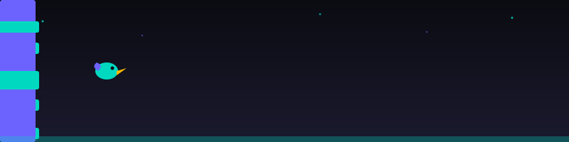

<div align="center">


<a href="https://git.io/typing-svg">
  
</a>

<br/>


[](https://linkedin.com/)
[](mailto:muhammadarkanmariadi@gmail.com)
[](#)

</div>

<br/>

## 👋 About Me

```javascript
const arkan = {
  role: "Full-Stack Developer",
  location: "Malang, East Java, Indonesia 🇮🇩",
  education: "SMK Telkom Malang — Software Engineering (Full-Stack) '24-Present",
  experience: "1+ years shipping real-world products",
  currentlyBuilding: ["Moklet Nexa (JHIC 2026)", "Moklet Art Club Platform"],
  funFact: "Also ports Minecraft mods across versions 🎮",
  motto: "Ship clean, modular, and scalable systems."
};
```

- 🔭 Currently building **Moklet Nexa** — a school website for JHIC 2026, and **Moklet Art Club (MAC)** platform (Turborepo monorepo, Spec-Driven Development)
- 🌱 Currently deepening my skills in **AI-integrated systems** (forecasting, automation) and **system architecture**
- 🎯 Delivered **5 full-stack projects**, including a live system deployed for a real-world event
- 🎸 PIC (Person in Charge) of Music Studio at **Moklet Art Club**
- 💬 Ask me about **Next.js, Laravel, Nest.js**, decoupled architecture, or Minecraft modding
- ⚡ Fun fact: I balance shipping production code with mixing music and modding Minecraft in Java

<br/>

## 🚀 Tech Stack

<div align="center">

### Frontend


### Backend


### Database & DevOps


</div>

<br/>

## 💼 Featured Projects

<table>
<tr>
<td width="50%">

### 🎪 [Mexpo](https://mexpo.id)
Event management platform for **Expo-Expose 2026**, deployed live at Surabaya Grand City.
`Next.js` `Nest.js` — Led backend development

</td>
<td width="50%">

### 📦 Inventra
Multi-tenant inventory management platform with **AI stock forecasting** (Prophet algorithm), RBAC & QR scanning.
`Next.js` `Laravel` `FastAPI` `Docker`

</td>
</tr>
<tr>
<td width="50%">

### 👕 rewear.id
C2C preloved marketplace with escrow checkout flow, built in a **3-day MVP sprint**.
`Next.js 16` `React 19` `Tailwind v4` `Zustand`

</td>
<td width="50%">

### 🌱 Hijauin
Landing page, auth flow & multi-role dashboard with centralized API service layer.
`Next.js` `TypeScript` `Laravel`

</td>
</tr>
</table>

<br/>

## 🏆 Certifications & Achievements

- 🥈 **Semi Finalist** — Jagoan Hosting Infra Competition (JHIC) 2025
- 🎯 **Participant** — National Hackathon *CodeCollab: Solving Today's Challenges Together*, HMSE Telkom University Purwokerto

<br/>

## 📊 GitHub Stats

<div align="center">


</div>

<br/>

## 🐍 Contribution Snake

<div align="center">

</div>

> Generated automatically by the `snake.yml` GitHub Action from your contribution graph, pushed to the `output` branch.

<br/>

## 🎮 Fun Zone — Flappy Bird

<div align="center">


**GitHub READMEs can't run JavaScript**, so this banner is just a decorative SVG animation — but the game itself is fully playable 👇

[](https://muhammadarkanmariadi-debug.github.io/muhammadarkanmariadi-debug/flappy-bird-game.html)

</div>

> **Setup:** commit `flappy-bird-game.html` and `flappy-bird-banner.svg` to the root of this repo, enable **GitHub Pages** (Settings → Pages → Deploy from branch → `main`), then the badge link above will open a live, playable game. Controls: `Space` / click / tap to flap.

<br/>

## 🤝 Let's Connect

<div align="center">

[](https://linkedin.com/)
[](mailto:muhammadarkanmariadi@gmail.com)
[](https://wa.me/6282132736902)

<br/>

*"Building modular, scalable systems — one project at a time."*

</div>


